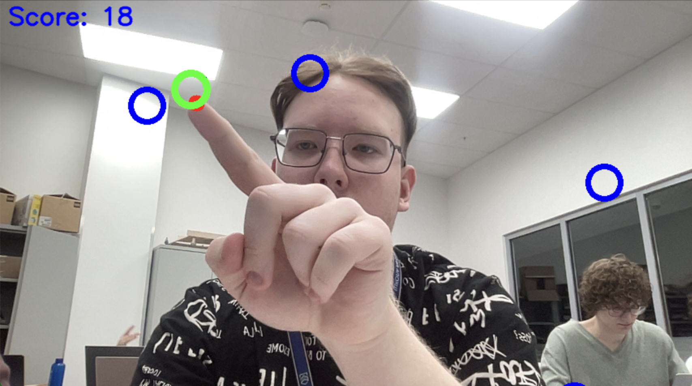
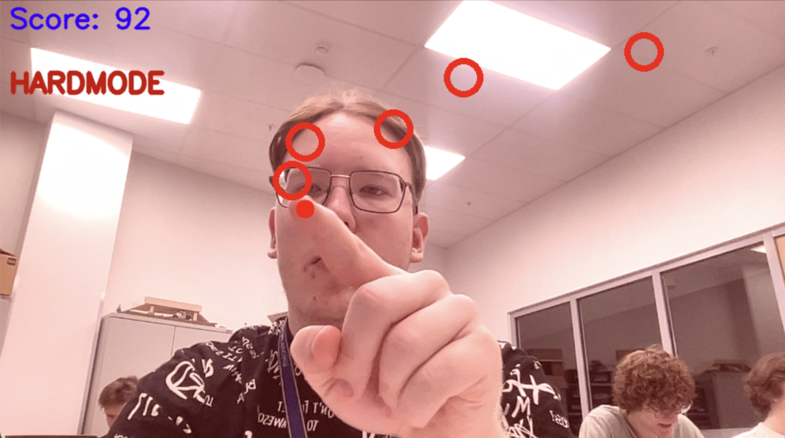
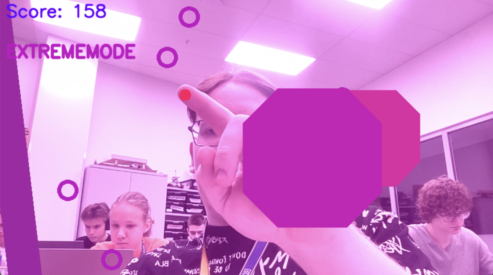

==========================Falling Circles===========================

Falling Circles is an interactive game where players must catch falling circles using hand gestures detected by a webcam. 
The game features different modes, including hard mode and extreme mode, which increase the difficulty as the player progresses.  

=============================Features============================

1. Hand gesture detection using mediapipe
2. Dynamic difficulty levels
3. Background music and sound effects
4. Interactive elements like hamsters and hinders
   
===========================Requirements==========================

1. Python 3.12.2
2. OpenCV
3. Mediapipe
4. Pygame
5. Numpy

=============================IMPORTANT!========================

The game can cause epileptic seizures!
There are frequent flashes of light!

============================Installation============================

Clone the repository:  

1. ```git clone https://github.com/STIPCHIK/FallingCircles.git```
2. ```cd FallingCircles```
3. Install the required packages:  
   ```pip install -r requirements.txt```
4. Ensure you have the necessary media files in the static directory:  
*  static/images/hamster.png
*  static/music/default_music.mp3
*  static/music/hardmode_music.mp3
*  static/music/extrememode_music.mp3
*  static/sounds/death.wav
*  static/sounds/levelup.wav
*  static/sounds/pickup.wav
  
==========================Running the Game==========================

To start the game, run the following command:
|  ```python3.12 main.py```

I recommend you to play:
1. With good lighting
2. Skin-contrasting clothing

============================Screenshots=============================





==============================Credits===============================

Game programmed by Nikita Shilov as a school IT project.
The extreme difficulty level was inspired by the Geometry Dash game.
Game may use copyright images, music and sounds.

==============================Status================================

Now my game **still in progress**, but it's completed by 80-90 percents. I'm working on graphics in my game.
